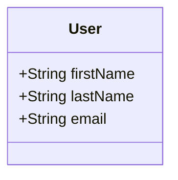

# FullStackSpringProject

### Descritption
> A simple fullstack project for study.

## Table of Contents

- [Installation](#installation)
- [API Endpoints](#api-endpoints)
- [Database](#database)


## Installation

1. Clone the repository:

```bash
$ git clone https://github.com/K4u4Guimaraes/FullStackSpringProject.git
```

2. Install dependencies with Maven

3. Install dependencies with npm

4. Run the front-end application:
```bash
  npm run dev
```


## Usage

1. Start the application with Maven
2. The API will be accessible at http://localhost:8080


## API Endpoints
The API provides the following endpoints:

```markdown
GET /base/employee/employees - Retrieve a list of all data.

GET /base/employee/{id} - Retrieve one of all the data.

POST /base/employee - Register a new data.

PUT /base/employee/{id} - Alter data.

DELETE /base/employee/{id} - Inactivate data.
```

## Database

The project uses PostgresSQL as the database.

To install PostgresSQL locally you can [click here](https://www.postgresql.org/download/).

### Class Diagram



###
